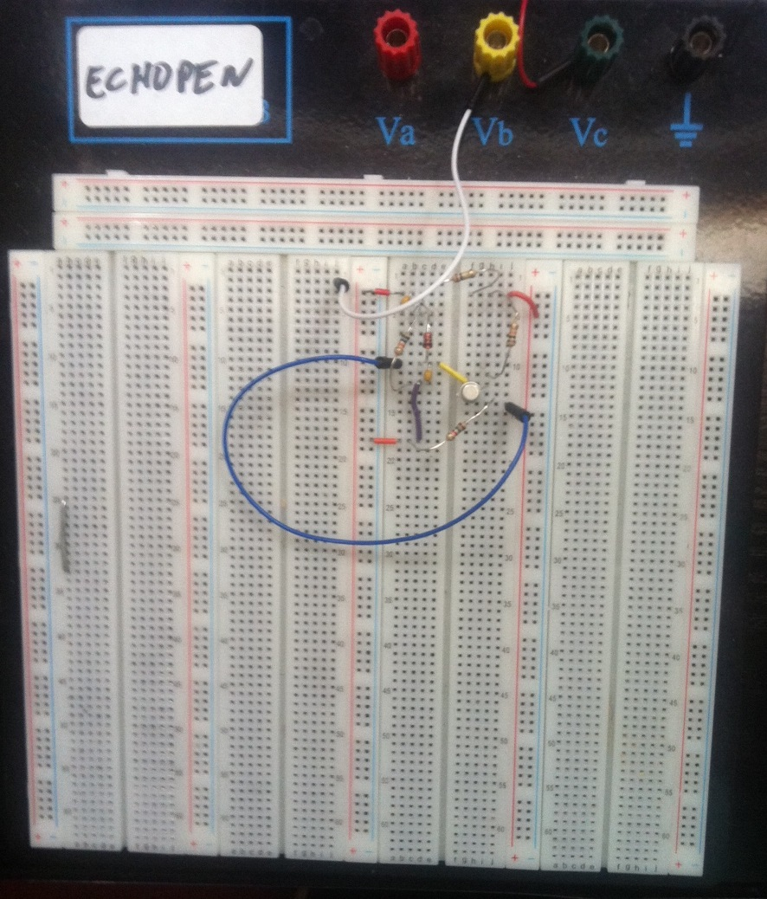
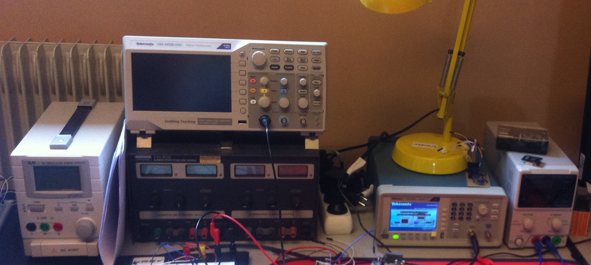

# Matériel

Pour fabriquer la sonde il faut le matériel type d&#39;un élecctronicien. Voici quelques conseils pour s&#39;équiper correctement. La liste suivante ( [LabTool](http://echopen.org/index.php/LabTools)) est une liste de composants et de consommables considérés comme essentiels et minimum requis à la création rapide d&#39;un laboratoire ou d&#39;un centre de recherche destiné au développement de la sonde Echopen.

| **Nom** | **Commentaires** | **Nom** | **Commentaires** |
| --- | --- | --- | --- |
| **ÉQUIPEMENTS** 
| écapeur thermique |   | Clés Allen (kit) |   |
| Tournevis (Kit) | 1 vis + 35 têtes | Clés Torx (kit) | T6, 10, 15, 20, 25 |
| Jeu de pince | Jeu de 5 pinces | Bread Bord | 2560 ports |
|Pince coupante |   | Aération | Ventilateur + gaine |
| Pince à dénuder |   | Multimètre |   |
| Dremel + support | Dremel 4000/support 220: perçage, découpage, ponçage | Alimentation de laboratoire | Voltage : 0 - 30 VAmpérage : 0 - 5 A |
| Pied à coulisse |   | Poste à souder |   |
| Cutter |   | Lunettes de soudage |   |
| Clé (kit) | Tailles : 8, 10, 11, 12, 13, 14, 17, 19, 22 | Pompe à dé-souder |   |
| Douilles (kit) | 2 clés à cliquet + douilles de 4 à 6 (pas de 0.5), de 7 à 24 (pas de 1), 27, 30, 32 | Pince brucelle plastique |   |
| **COMPOSANTS ET CONSOMMABLES** 
| Amplificateur | 10 unités | Réservoir à flux | Tresse à souder |
| CAN | 5 unités | Tapis à souder anti-statique |   |
| CNA | 5 unites (10 MHz, 8 bits) | Kit de résistances |   |
| Kit d&#39;inductances | 160 inductances de 1µH à 470 µH | Kit de condensateurs |   |
| Carte prototype | 160\*100 | Bouteille de flux (100 mL) |   |
| Adaptateur crocodile/banane |   | Micro controleur | Adapté pour Arduino |
| Câble BNC-banane |   | Loupe |   |
| Câble banane-banane |   | Moteur avec encodeur | Voltage : 12 VVitesse : 500 rpm1216 positions |
| Kit de fils pour Bread Board |   | ou Moteur pas-à-pas |   Voltage: 12V  Vitesse:450-500 rpm  1080 positions |
| Barette de connexion |   | Condensateur |   100 pF  470 pF  1000 pF |
| Etain |   | Inducteur |   4.7 mH |
| Vernis électronique |   | Transistor MOSFET |   |
| Nettoyant de flux |   | Kit de gaine  thermorétractable |   |

_table 1: labtool_

_Figure 1: Pinces pour électronique, matériel d’atelier. Méthode de rangement du matériel._

_Figure 2: plateforme type de travail: le breadboard_

_Figure 3: Appareils de test_

L’oscilloscope et le multimètre permettent d’accéder rapidement aux valeurs directement sur le circuit (il faut des câbles de connections pour prendre les mesures depuis le breadboard vers oscilloscope)
Le GBF permettra de simuler les différentes entrées pour une fonction sans passer par le reste du circuit.